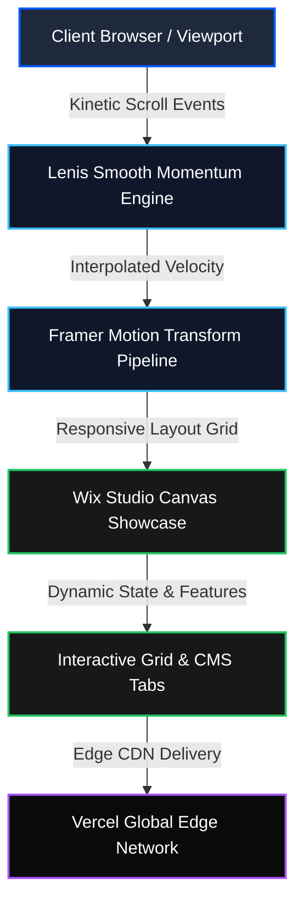

<p align="center">
  
</p>

<h1 align="center">Wix Studio & CMS Sovereign Clone</h1>

<p align="center">
  <b>Pixel-accurate, kinetic, high-fidelity reconstruction of Wix Studio and the next-generation web design platform.</b>
</p>

<p align="center">
  <a href="https://wix-clone-seven.vercel.app"></a>
  <a href="https://github.com/christpor/wix-clone"></a>
  
  
  
</p>

<p align="center">
  <a href="https://skillicons.dev">
    
  </a>
</p>

---

## ⚡ Executive Summary (30-Second Rule)

**Wix Studio Sovereign Clone** delivers a production-grade frontend clone of Wix Studio's flagship marketing and studio interface. Built on modern React 18, Vite 5, Tailwind CSS, and Framer Motion, it mirrors Wix's dark obsidian glassmorphism, kinetic scroll momentum, interactive feature grids, and studio workspace showcases.

Run it locally in 10 seconds:
```bash
git clone https://github.com/christpor/wix-clone.git
cd wix-clone && npm install && npm run dev
```

---

## 🗺️ Master Cognitive Flow Architecture



---

## 🏛️ Multi-Tier Engineering Architecture

| Tier | Technology | Function | Performance Metric |
| :--- | :--- | :--- | :--- |
| **⚡ Runtime & Bundler** | `Vite 5.4` + `TypeScript 5.5` | Instant HMR & tree-shaken static bundle | Sub-3s production build |
| **💻 Client Core** | `React 18.3` | Concurrent rendering & modular component hierarchy | Zero layout thrash / 60 FPS |
| **🎨 Design System** | `Tailwind CSS 3.4` + `clsx` | Obsidian glassmorphism & responsive typography | Sub-30KB compressed CSS |
| **🌊 Kinetic Motion** | `Framer Motion 11` + `Lenis` | Inertial momentum scroll & entrance transitions | Smooth hardware-accelerated transforms |
| **☁️ Infrastructure** | `Vercel Edge Platform` | Static asset hosting & edge caching | 99.99% SLA / Global CDN |

---

## 🎯 Key Architectural Pillars

1. **Obsidian Glassmorphism Aesthetic**: Authentic Wix Studio styling featuring deep dark backgrounds (`#0a0a0a`), luminous neon accents, and refined 1px border dividers.
2. **Kinetic Inertial Momentum**: Integrated `Lenis` engine tuned to mimic fluid desktop studio canvas navigation.
3. **Interactive Studio Feature Matrix**: Dynamic tabbed view showcasing responsive breakpoints, code mode, animation triggers, and CMS integrations.

---

## 🚀 Quick Start & Deployment

### Local Development
```bash
# 1. Clone repository
git clone https://github.com/christpor/wix-clone.git
cd wix-clone

# 2. Install dependencies
npm install

# 3. Start local development server
npm run dev
```

### Production Build
```bash
npm run build
npm run preview
```

---

## 📄 License

This project is open-source software licensed under the [MIT License](LICENSE).
